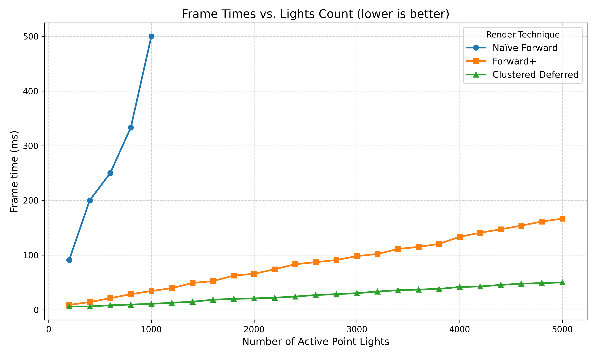
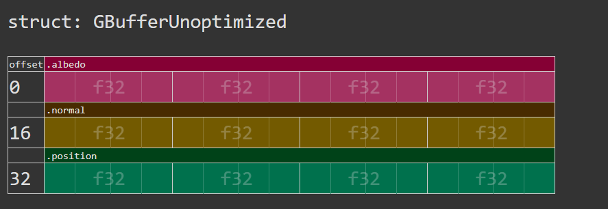
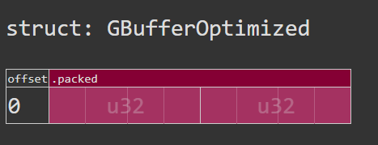
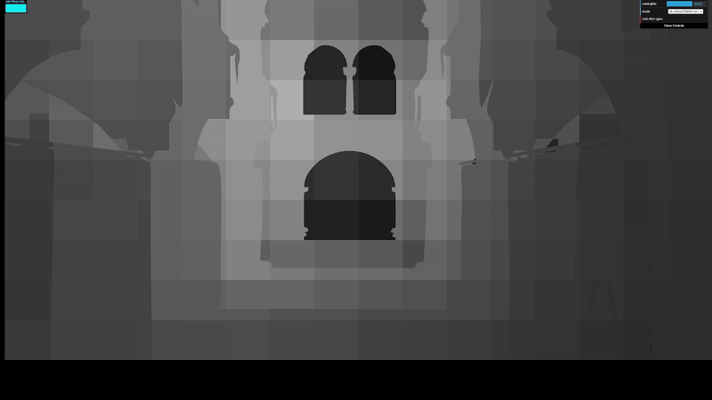

# WebGL Forward+ and Clustered Deferred Shading

**Vismay Churiwala**

- [LinkedIn](https://www.linkedin.com/in/vismay-churiwala-8b0073190/) | [Website](https://vismaychuriwala.com/)
- Tested on: Google Chrome 141.0.7390.123, Windows 11, AMD Ryzen 7 5800H @ 3.2GHz (8C/16T), 32GB DDR4 RAM, NVIDIA GeForce RTX 3060 Laptop GPU (6GB GDDR6)

## Live Demo

 Try it yourself at [https://vismaychuriwala.github.io/WebGPU-Forward-Plus-and-Clustered-Deferred](https://vismaychuriwala.github.io/WebGPU-Forward-Plus-and-Clustered-Deferred)!

https://github.com/user-attachments/assets/206d7b6f-db5a-4ae4-97de-e5a7cf5c3fbd

> The sponza scene using Clustered Deferred Rendering with 5000 lights.

## Features Implemented

- **Naive Forward Rendering**
- **Forward+ Rendering**
- **Clustered Deferred Rendering**
- **G-buffer Optimization**
- **Debug Visualization**

## Overview

This project implements and compares three rendering techniques for scenes with thousands of dynamic lights using **WebGPU**. The test scene features the Sponza atrium with up to 5,000 moving point lights.

### Rendering Methods

**Naive Forward Rendering**: The baseline approach where each fragment evaluates all lights in the scene. With thousands of lights, this becomes a major performance bottleneck due to redundant light calculations.

**Forward+ Rendering**: Divides the view frustum into a 3D grid of clusters and builds a data structure tracking which lights affect each cluster. Fragments only evaluate lights in their cluster, significantly reducing the computational cost per pixel.

**Clustered Deferred Rendering**: Improves upon Forward+ by decoupling geometry processing from lighting calculations. A geometry pass writes surface attributes to a G-buffer, then a separate fullscreen pass performs all lighting. This is faster than Forward+ because lighting is only computed once per visible pixel—overlapping geometry (overdraw) doesn't cause redundant lighting calculations since depth testing happens before the lighting pass.

### Implementation Details

**Light Clustering Data Structure**: The clustering system uses a dual-buffer approach with a 16×9×24 grid (3,456 clusters). The `clusterLightGridBuffer` stores offset/count pairs (2×u32 per cluster) indicating where each cluster's light list starts in the `clusterLightIndexBuffer` and how many lights it contains. Each cluster can reference up to 1,024 light indices. This indirect indexing scheme is memory-efficient and enables cache-friendly sequential access during shading.

**Clustering Compute Shader**: Runs with an 8×8 workgroup size in XY, dispatching one thread per cluster. Each thread computes its cluster's view-space AABB by:
1. Using logarithmic Z-slicing for exponentially-distributed depth slices that allocate more precision to nearby geometry
2. Converting NDC tile boundaries to view-space using precomputed FOV tangents
3. Computing the frustum-aligned bounding box from the four corner rays at the cluster's near and far depth planes

Light assignment uses sphere-AABB intersection testing. For each light, the shader transforms its world position to view space, performs a quick Z-range rejection test, then computes the squared distance from the light center to the AABB. Lights within the sphere radius are added to the cluster's index list.

**Forward+ Fragment Shading**: Each fragment computes its cluster coordinates by transforming its world position to view space, projecting to normalized device coordinates using FOV tangents, then mapping to discrete tile indices. The Z tile uses the inverse of the logarithmic depth function to match the clustering shader's exponential slicing. The cluster record provides the offset and count, allowing iteration over only the relevant lights. This reduces shading complexity from O(N) to O(k) where k is the average lights per cluster (~10-50 depending on light density).

**G-buffer Compression**: Achieves an extremely compact 64-bit-per-pixel G-buffer using a single `rg32uint` texture:
- **Channel R (32 bits)**: Albedo RGB packed as `(R << 16) | (G << 8) | B` with 8 bits per color channel
- **Channel G (32 bits)**: Normal XY packed via `pack2x16snorm`, storing each component as a signed 16-bit normalized value
- **Normal reconstruction**: The Z component is recovered by exploiting unit-length normal constraints
- **Position reconstruction**: World position is derived from depth buffer and screen coordinates by inverting the view-projection matrix

This eliminates three `vec4f` textures (48 bytes/pixel) down to a single compact format (8 bytes/pixel), a 6× memory reduction.

**Clustered Deferred Pipeline**: The geometry pass renders all objects while writing to the packed G-buffer and depth texture. The fullscreen lighting pass then:
1. Reads packed G-buffer values using `textureLoad` at integer pixel coordinates
2. Unpacks albedo via bit shift operations and normals via `unpack2x16snorm`
3. Reconstructs world position from depth and screen coordinates
4. Performs the same cluster lookup as Forward+ to retrieve the light list
5. Accumulates lighting contributions only for visible pixels

The key advantage is that lighting is computed exactly once per screen pixel. In Forward+, overlapping geometry causes multiple lighting calculations for the same pixel (overdraw waste), but deferred rendering performs depth testing before lighting, eliminating redundant work in complex scenes.

## Performance Analysis

### Rendering Method Comparison

The graph below compares frame times across the three rendering methods with varying light counts:

Clustered Deferred is fastest, followed by Forward+. At 5000 lights, Clustered Deferred is the only usable rendering technique with ~20fps vs ~6fps for Forward+ rendering.

**Workload characteristics:**
- **Naive Forward**: O(N × fragments) - evaluates all lights per fragment
- **Forward+**: O(k × fragments) where k = lights per cluster. Wastes work on overdraw
- **Clustered Deferred**: Lights only visible pixels, eliminating overdraw waste

**Benefits and tradeoffs:**
- **Forward+**: No G-buffer memory, simpler, supports transparency/MSAA | Wastes computation on overdraw
- **Clustered Deferred**: Best with complex geometry, flexible shading | Requires G-buffer, no native transparency

**Why the difference?** Sponza has high overdraw (overlapping columns, arches). Forward+ lights all geometry layers; Clustered Deferred only lights visible surfaces. G-buffer compression minimizes memory overhead.

### G-Buffer Optimization

Compressed from 3× vec4f textures (48 bytes/pixel) to 1× vec2<u32> (8 bytes/pixel) - a 6× reduction.

**Before (Unoptimized):**

**After (Optimized):**

**Performance impact:**

| Configuration | Frame Time (Before) | Frame Time (After) | Improvement |
|--------------|--------------------|--------------------|-------------|
| 1920×1080, 5000 lights | 48 ms | 42 ms | 12.5% faster |

**Best case:** High resolution + bandwidth-bound scenes. Reduces G-buffer fetches from 3 to 1.

**Worst case:** Low-light scenes where bit packing overhead isn't offset by bandwidth savings.

**Tradeoffs:**
- Albedo: 8-bit vs 32-bit float (minimal visual difference)
- Normals: 16-bit compressed XY (< 0.1% precision loss)
- Position: Reconstructed from depth (adds matrix multiply, saves 16 bytes/pixel)

**Further optimizations:** Octahedral normal encoding, visibility buffer, material IDs in unused bits.

### Effect of Cluster Grid Resolution

| Grid Size (X×Y×Z) | Total Clusters | Frame Time | Notes |
|-------------------|----------------|------------|-------|
| 8×4×12 | 384 | 77 ms | Coarse, fewer cache misses |
| 16×9×24 | 3,456 | 42 ms | Balanced (current) |
| 32×18×24 | 13824 | 41 ms | Fine, more overhead |

Note that the grid sizes are logarithmical in the depth direction, which impacts performance and visual quality massively compared to linear z which causes lots of clusters to get saturated while others stay empty.

Finer grids reduce lights per cluster but increase compute overhead and cache misses. 16×9×24 balances this with 10-50 lights per cluster.

### Z-Slicing Strategy: Linear vs Logarithmic

The choice between linear and logarithmic z-slicing dramatically affects cluster light distribution. The debug visualizations show brightness based on the number of lights in each cluster, with red indicating clusters that have exceeded `MAX_LIGHTS_PER_CLUSTER` (1,023).

<table>
<tr>
<td width="50%">

**Linear Z-Slicing**

Depth slices evenly distributed. Near clusters become oversaturated (red) while far clusters remain mostly empty.

</td>
<td width="50%">

**Logarithmic Z-Slicing**

More clusters allocated near the camera where lights concentrate. Better distribution prevents saturation.

</td>
</tr>
</table>

Logarithmic slicing matches the perspective projection's depth distribution, making it the preferred approach for real-time rendering.

### Credits

- [Vite](https://vitejs.dev/)
- [loaders.gl](https://loaders.gl/)
- [dat.GUI](https://github.com/dataarts/dat.gui)
- [stats.js](https://github.com/mrdoob/stats.js)
- [wgpu-matrix](https://github.com/greggman/wgpu-matrix)
